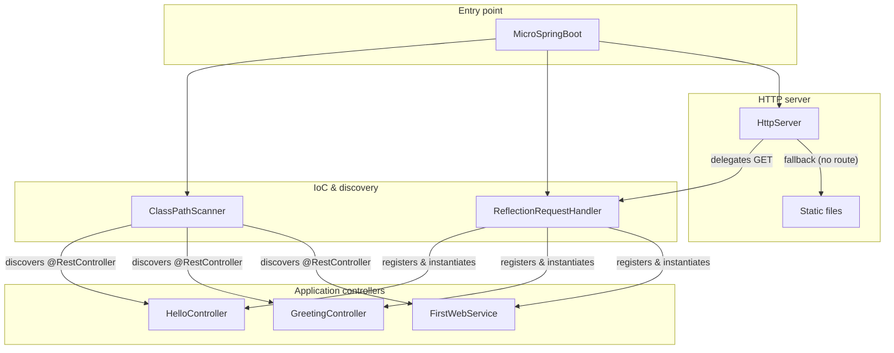
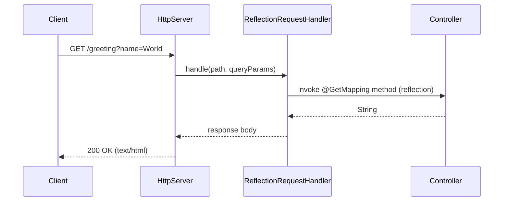

# Application Server Architectures Workshop

**Course:** TDSE — Transformación Digital y Soluciones Empresariales (Digital Transformation and Business Solutions)

**Goal:** Minimal prototype demonstrating Java reflection, POJO bean loading, and deriving a web application from them (IoC, reflection).

---

## Description

Java web server (Apache-style) that:

- Serves HTML pages and PNG images (static resources).
- Provides an IoC framework for building web applications from POJOs.
- Handles multiple **non-concurrent** requests (one at a time).
- Uses **reflection** to discover annotated components (`@RestController`, `@GetMapping`, `@RequestParam`) and publish REST services.

---

## Design and Architecture

### Architecture diagram



**Request flow (sequence):**



### Main components

1. **Annotations**  
   - `@RestController`: marks a class as a REST component; the framework instantiates it and publishes its annotated methods.  
   - `@GetMapping("/path")`: maps a method that returns `String` to a GET URI.  
   - `@RequestParam(value = "name", defaultValue = "value")`: injects query parameters into the method.

2. **HttpServer**  
   Minimal HTTP server (socket on port 35000). For each GET:
   - Asks the `RequestHandler` first (REST routes).
   - If no route matches, serves static files from `src/main/resources/static/` (HTML, PNG, etc.).

3. **ReflectionRequestHandler**  
   - Keeps a map `path → (instance, method)`.
   - When registering a controller: instantiates the class via reflection, iterates methods with `@GetMapping`, gets the URI and stores the invocation.
   - In `handle(path, queryParams)`: invokes the method passing parameters according to `@RequestParam` (reflection on parameters).

4. **ClassPathScanner**  
   Scans the classpath (directory and JAR) for classes annotated with `@RestController` under the framework package, so they do not need to be listed on the command line.

5. **MicroSpringBoot**  
   Entry point:
   - **With arguments:** loads only the specified classes (e.g. `co.edu.escuelaing.reflexionlab.controller.FirstWebService`).
   - **Without arguments:** uses `ClassPathScanner` to load all classes with `@RestController` under the base package.

### GET request flow

1. `HttpServer` receives the request line and parses path and query.
2. Calls `RequestHandler.handle(path, queryParams)`.
3. If it returns a `String`, it is sent as HTML response.
4. If it returns `null`, a static file (HTML/PNG) is tried.
5. If no file is found, responds with 404.

---

## Requirements

- Java 11+
- Maven 3.6+

---

## Installation and usage

### Clone and build

```bash
git clone <repository-url>
cd TDSE-application-server-architectures
mvn clean compile
```

### Run

**Option 1 – Load by command line (first version)**  
Pass `@RestController` class names as arguments:

```bash
mvn exec:java -Dexec.mainClass="co.edu.escuelaing.reflexionlab.MicroSpringBoot" -Dexec.args="co.edu.escuelaing.reflexionlab.controller.FirstWebService"
```

Or with `java` directly:

```bash
java -cp target/classes co.edu.escuelaing.reflexionlab.MicroSpringBoot co.edu.escuelaing.reflexionlab.controller.FirstWebService
```

**Option 2 – Classpath scan (final version)**  
No arguments; all `@RestController` classes under the package are loaded:

```bash
mvn compile exec:java -Dexec.mainClass="co.edu.escuelaing.reflexionlab.MicroSpringBoot"
```

Server runs at **http://localhost:35000**.

### Manual testing

- `http://localhost:35000/` → message from `HelloController`.
- `http://localhost:35000/greeting` → “Hola World” (default).
- `http://localhost:35000/greeting?name=YourName` → “Hola YourName”.
- `http://localhost:35000/hello` → message from `FirstWebService` (if loaded).
- `http://localhost:35000/index.html` → static page.

---

## Automated tests

JUnit 5 is used for:

- **ReflectionRequestHandlerTest:** controller registration, `@GetMapping` invocation, `@RequestParam` and default value support, multiple controllers.
- **ClassPathScannerTest:** verifies the scanner finds classes with `@RestController`.

Run tests:

```bash
mvn test
```

---

## Maven structure

```
src/main/java/co/edu/escuelaing/reflexionlab/
  MicroSpringBoot.java                                     # Entry point
  annotation/                                             # Annotations
    RestController.java, GetMapping.java, RequestParam.java
  server/                                                 # HTTP server
    HttpServer.java, RequestHandler.java
  ioc/                                                    # IoC and reflection
    ReflectionRequestHandler.java, ClassPathScanner.java
  controller/                                             # Example controllers
    HelloController.java, GreetingController.java, FirstWebService.java
src/main/resources/static/
  index.html
src/test/java/co/edu/escuelaing/reflexionlab/
  ReflectionRequestHandlerTest.java, ClassPathScannerTest.java
pom.xml
```

---

## AWS deployment

### Steps

1. Build: `mvn package`.
2. Upload the JAR to an EC2 instance (or clone the repo and run `mvn package` there). Ensure Java 11+ is installed.
3. Run the server (e.g. `java -jar target/reflexionlab-1.0-SNAPSHOT.jar` or with `-cp target/classes ... MicroSpringBoot`).
4. Open port **35000** in the instance security group.
5. Access `http://<public-IP>:35000`.

### AWS deployment evidence

*Add your screenshots below. Place image files in the `docs/aws/` folder and reference them here.*

**1. EC2 instance / server running**

<!-- Add your screenshot: e.g.  -->

**2. Application responding in the browser**

<!-- Add your screenshot: e.g.  -->

**3. (Optional) Additional evidence (e.g. Security Group, terminal)**

<!-- Add your screenshot: e.g.  -->

---

## References

- Workshop: Object meta-protocols, IoC pattern, reflection.
- Source code and lifecycle managed with Maven; project on GitHub; AWS deployment evidence as per deliverables.
